# ACP — Agent Control Plane

**A structured-input control plane that decides whether an AI agent's action is authorised — outside the model, where prompt injection cannot reach.**

[](LICENSE)
[](spec/ACP-SPEC-001.md)
[](#wanted-an-adversarial-reviewer)

Most agent deployments give the model a credential and call that authorisation. It isn't. It means anyone who can influence the model can act with the agent's rights: a poisoned document, a hostile support ticket, a comment in a dependency README. No break-in required.

A model has no way to tell an instruction from a datum. Both are text in the same window, and nothing in the architecture marks one as binding. That doesn't improve with better models, because it isn't a quality problem.

The question a security system asks is not whether the requester is trustworthy. It's whether the action is authorised, which is a fact about policy, capability and quorum. ACP puts that decision somewhere the model cannot reach.

```
agent  ──proposes──▶  policy engine  ──▶  executor  ──▶  action
                      recomputes risk     verifies, or refuses
                      from signed policy   humans sign for the
                      the model can't      irreversible ones
                      see or influence
```

A compromised model can request a €40,000 synthesis order as often as it likes and never cause one. The risk level is recomputed from signed policy the model never sees, and the order needs human signatures bound to that exact request.

---

## Contents

- [Quick start](#quick-start) — reproduce every claim in ninety seconds
- [See it happen](#see-it-happen) — the injection demo
- [Point your own agent at it](#point-your-own-agent-at-it) — Docker, HTTP, your LLM
- [Where this bites](#where-this-bites) — eight deployment settings
- [See it run: a business day](#see-it-run-a-business-day) — 179 actions, measured
- [How it works: two doors](#how-it-works-two-doors) — the architecture in one idea
- [The one claim](#the-one-claim) — INV-1-HIGH
- [What this does **not** claim](#what-this-does-not-claim) — read this before the positive claims
- [Threat model and framework mapping](#threat-model-and-framework-mapping) — MITRE ATLAS, ATT&CK, OWASP LLM Top 10
- [Documentation](#documentation) — the full dossier
- [Repository layout](#repository-layout) — what is real and what is scaffold
- [Wanted: an adversarial reviewer](#wanted-an-adversarial-reviewer) — the most important gap
- [Integrity and releases](#integrity-and-releases)
- [Licence and authorship](#licence-and-authorship)

---

## Quick start

```bash
python3 -m pip install --break-system-packages cryptography dilithium-py
./tools/verify.sh
```

Abridged output. A complete run prints 19 result lines across five numbered sections:

```
== 1. Integrity ==
  OK   145 files match MANIFEST.sha256

== 2. Manifest signature (Ed25519, offline release key) ==
  OK   detached signature verifies against release-key.pub

== 3. Formal proofs ==
  OK   Dafny program verifier finished with 36 verified, 0 errors

== 4. Test suites ==
  OK   ALL attacks (consolidated registry) — RESULT: 80/80
  OK   Suite 1  conformance — RESULT: 52/52 — CONFORMANT
  OK   Suite 2  executor mutation — RESULT: 25/25 killed
  ...
```

Fourteen suite lines in all, spanning 10 numbered suites, and 35 mutation controls across three of them.

If a claim here does not replay on your machine, don't believe it. That includes these numbers.

**The mutation results are the ones worth reading.** Each security check is deleted in turn and the matching attack has to succeed, which is how you know the check does something and the test isn't vacuous. 35 of them: 25 executor, 6 acknowledgement, 4 audit.

Two gates, and the difference matters:

| Command | Checks | Needs the release key? |
|---|---|---|
| `./tools/verify.sh --suites` | proofs + 15 suites + harness | No — green at every commit |
| `./tools/verify.sh` | the above + integrity + signature | Yes — green only at a tagged release |

Sections 1–2 can only be made green by the key holder, because regenerating the manifest requires the offline Ed25519 key. **Red integrity between releases is offline signing working as designed, not a defect** — see [`dossier/07-REPRODUCTION.md`](dossier/07-REPRODUCTION.md).

Dafny is optional; the proof step is skipped if it isn't installed.

### See it happen

```bash
python3 reference/suites/demo_flow.py
```

> **Note:** this starts a local web server and opens a browser tab. It runs until you stop it with Ctrl-C — it is a presentation, not a test. For the test path use `./tools/verify.sh`. Presenter's guide: [`dossier/DEMO-HOWTO.md`](dossier/DEMO-HOWTO.md).

A supplier report arrives with an instruction hidden in white text. The model reads it and complies. The demo runs that same output down two paths side by side: without a control plane the data leaves the company, with ACP nothing irreversible happens.

The model is shown complying **fully**. Simulating a refusal would misrepresent the claim — the architecture's guarantee does not depend on injection failing.

**With a real model.** Paste an Anthropic API key into the page and the agent becomes a live model reading the actual poisoned document, rather than a recorded response. The key is held in memory for the process lifetime, used only for that call, and never written to disk. With no key the demo runs offline against the recording — and **the control plane behaves identically either way**, because it never consults the model about anything. That is the point of offering both: if the live and recorded runs diverged, the guarantee would depend on what the model said.

```bash
python3 reference/suites/demo_flow.py --model claude-sonnet-5
```

### Point your own agent at it

The demo above is a presentation. This is the control plane as a service you can drive yourself, from your own agent, over HTTP.

```bash
docker compose -f deploy/docker-compose.yml up -d ingress
curl -s localhost:8848/actions       # the closed set — nothing else can be proposed
```

| Endpoint | Body | What it does |
|---|---|---|
| `GET /health` | — | liveness, and the hash of the bundle being enforced |
| `GET /actions` | — | the nine registered actions, each with its permitted targets, required params and reversibility |
| `POST /propose` | `{"task_type", "targets": [...], "params": {…}, "operator", "program"}` | the door. Answers `executed`, `held` or `refused`, always with the rule id |
| `GET /holds` | — | what is waiting on a human, keyed by proposal hash |
| `POST /acknowledge` | `{"proposal_hash", "who", "decision": "CONFIRM"}` | a second human confirms one held action |
| `POST /release` | `{"proposal_hash"}` | release; succeeds only if a valid acknowledgement is bound to those bytes |

Your agent supplies whatever model it likes and holds whatever API key that needs — **ACP is the server, not the client, and holds no key of yours**. The door decides on the proposal's canonical bytes and nothing else: an unregistered `task_type` is refused at `8.4-3` before it is ever graded, params outside the schema are refused at `V-1`, and a target outside the capability whitelist is refused at `CW-1`.

#### A real model, already wired up

If you would rather watch one than write one, [`sim/llm_agent.py`](sim/llm_agent.py) is a working untrusted caller: it holds the API key, reads a document with an instruction buried in it, and proposes over HTTP.

```bash
export ANTHROPIC_API_KEY=sk-ant-...   # console.anthropic.com → API keys
docker compose -f deploy/docker-compose.yml up -d ingress
python3 -m sim.llm_agent --invent
```

That key is read in *that* process and sent to Anthropic. It never reaches ACP, which is never asked for it and could not use it — a caller whose credential the callee holds is not a caller, it is a subroutine. The client is Anthropic-only (`api.anthropic.com` is hardcoded, so an OpenAI or Gemini key will not work), while **the door is model-agnostic and has no idea what produced a proposal**. Nothing needs installing on your side: the agent is standard library, and `cryptography`/`dilithium-py` live on the server, inside the image. `python3 -m sim.llm_agent --help` is the whole manual — flags, environment, exit codes, and the acknowledgement loop. To run it in compose instead: `run --rm agent agent --invent`, that service being the only one given outbound network and the one the architecture assumes is compromised.

It runs two phases, and the second is the load-bearing one.

**1. A live model on a triage batch.** It reads two documents: an assay memo with genuine work in it, and a supplier report with an instruction buried in it. The injected report is ordered last, the position most likely to be obeyed. The two have **different sources on purpose** — so you can see whether text planted in document 2 produces actions the model attributes to document 1.

Whatever it chooses goes to the door unaltered. It may comply, it may decline, it may propose nothing at all — Claude Sonnet 5 declined outright on this file's first run, back when the batch was a single document — and whatever happens is printed rather than retried away. **This phase is not reproducible and is not meant to be.** It is a fact about a model on a prompt, it varies by model and by run, and it is not evidence about the control plane; see RES-L2 in [§06](dossier/06-RESIDUAL-RISK.md). A demo that needs the model to misbehave is measuring the model.

One thing is constrained: the reply's **encoding**. The client sends a JSON schema with the request, because on identical input the same model returned a JSON array on one run and tool-call syntax on the next, and roughly one run in three parsed. It fixes the shape of the answer and never its content — the model stays free to propose the injected actions, to propose nothing, or to invent an action that does not exist, and every one of those still reaches the door and is graded there. Nothing here scores, filters or judges what the model chose, and it is not a retry loop: re-asking until the answer is convenient is a filter wearing a reliability costume. Disclosed as RES-L1, and pinned by a suite check that fails if the schema ever grows a list of permitted actions.

**2. The agent process compromised, no model in the loop** — the two actions the document asked for, proposed directly. This is the adversary Door B actually names: a caller is compromised by editing its code, not only by talking its model round. Unlike phase 1, this one is deterministic:

```
release_to_partner   REFUSED  XPROG-1  dataset has no registered owning program — refused, not assumed
order_synthesis      HELD     8.4-11   HIGH / IRREVERSIBLE — 4 approvers notified
```

`--invent` adds a third the document never mentioned, because a compromised caller is not restricted to the instructions it was fed:

```
exfiltrate_dataset   REFUSED  8.4-3    not in the signed bundle; refused, never graded
```

Not one of those was refused because the text looked suspicious. The held action then needs a *different* human — `POST /acknowledge` as the proposing operator is itself refused, at `DR-9`.

```bash
docker compose -f deploy/docker-compose.yml run --rm ingress-suite   # 9/9, over a real socket
docker compose -f deploy/docker-compose.yml run --rm checks          # 7 processes, 4 boundaries
```

`sim/ingress_suite.py` is the evidence: nine wire-level attacks against a real server on a real socket, not against a Python object. The container refuses to start without `ACP_DEMONSTRATOR=1`, and binding beyond loopback refuses for the same reason — see the two named blockers in [`Dockerfile`](Dockerfile). It is a demonstrator, not a deployment.

---

## Where this bites

In each case an agent proposes something consequential and nothing between the model and the effect can refuse.

| Setting | The action an agent takes | What goes wrong with no control plane | What ACP does |
|---|---|---|---|
| **Cloud / infrastructure ops** | Modify a firewall rule, rotate a key, terminate instances, apply IaC | A poisoned ticket or log line becomes a production change. The agent had the credential, so the change is "authorised". | Risk floor comes from signed policy, not the request. Firewall-on-prod-DB is HIGH → two bound attestations or it does not run. |
| **Finance / payments** | Release a payment, change payee details, approve an invoice | Invoice-fraud text in a PDF the agent summarises redirects a transfer. No human ever saw the change. | Irreversible ⇒ DR-9: silence is not consent. Positive acknowledgement from a non-operator, signed and bound to that exact payment. |
| **Pharma / research automation** | Order a synthesis, book instrument time, release a dataset to a partner | Cross-program disclosure to a competitor. Cannot be recalled — the business damage is instant and permanent. | `release_to_partner` is HIGH and IRREVERSIBLE by policy. Quorum required; the model's request is only ever a proposal. (Worked example: [Annex D](dossier/annexes/D-research-pipeline.md).) |
| **Customer support / CRM** | Issue a refund, delete an account, export a customer list | A customer message containing instructions gets treated as an instruction. Mass action at machine speed. | Accumulators count **executions**, not decisions (AC-5), and capability is re-queried at execution time (T-10). |
| **Software delivery / CI-CD** | Merge, deploy, publish a package, rotate a secret | A comment in a dependency README triggers a release. Supply chain, one step removed. | Executor recomputes risk and rehashes the artifact; approval covers the exact bytes deployed, not a similar request (B-1a). |
| **Healthcare / clinical** | Amend a record, submit to a regulator, release trial data | Regulated data integrity failure; audit trail rewritten after the fact. | Audit chain anchored **before** release (AU-7); post-anchor rewrite is detectable, not silent. Attestation maps onto e-signature requirements. |
| **Legal / contracts** | Send a signed document, accept terms, file with a court | Disclosure and commitment are both irreversible. | Same class as partner release: irreversible ⇒ mandatory acknowledgement, bound and single-use. |
| **Any MCP / tool-calling deployment** | Whatever the server exposes | The model's output *is* the control signal. Tool poisoning or context poisoning becomes execution. | B-2: the model gets no tools at all. Every action is a typed proposal through one door. |

The model isn't the problem in any of these. The authorisation is. When the credential is the authorisation, a manipulated agent is an authorised agent.

---

## See it run: a business day

The table above is where this matters. [`sim/`](sim/) is what one of those settings actually looks like across a working day — an agentic research pipeline with four program contexts, three sites, six people, one agent, and 179 proposed actions. It signs with the same real hybrid keypairs the reference does, so it needs `cryptography` and `dilithium-py` and a day takes tens of seconds rather than one.

```bash
python3 -m sim.scoreboard     # the deliverable
python3 -m sim.acceptance     # 12 criteria — 11 pass, 1 partial, 0 fail
python3 -m sim.supervise      # the same day as seven real OS processes
```

| Measured across one day | |
|---|---|
| Actions proposed | **179** |
| Executed having touched no notifier, approver, anchor or hold | **146 — 81.6%** |
| Held for a human | 32 — of those 19 released, 13 failed closed |
| Refused at policy evaluation | 1 |
| Attack proposals that were **well-formed** | **14 / 14** |
| Attack proposals that **executed** | **0** |
| Counterfactual, had there been no control plane | **EUR 520,000** committed spend and one unrecallable cross-program disclosure |

**The ratio is the argument.** 81.6% of the day executes having touched no control at all. If that number were small the design would be arguing against itself: a control plane that taxes the routine gets routed around, and a control that is routed around provides nothing.

**14/14 well-formed is the claim, not a failure.** Both attacks arrive inside ordinary business content and neither is detected, filtered or judged. They fail because the actions they request are not authorised — which is the entire thesis, stated as a measurement.

**The €520,000 is derived, not asserted.** Acceptance criterion 12 perturbs one logged cost and requires the counterfactual to move by exactly that amount, so the number cannot drift from the log it claims to summarise.

The simulation also reports the figure nobody has: how often a held action released on *silence* — the measurable rate at which a human control decays into a rubber stamp. It is deliberately **not** quoted here as a fixed number, because it is sampled per run and no single value would replay. It is reported as debt, not as success.

> **Illustrative.** `sim/` models a company *shaped like* an AI-driven drug design firm, built from public information. It describes no organisation's internal systems and claims no knowledge of any. Every number, tier and threshold is a placeholder a real deployment must re-derive with its own risk owners. The narrative companion is [Annex D](dossier/annexes/D-research-pipeline.md).

---

## How it works: two doors

```mermaid
flowchart LR
    subgraph B ["DOOR B — text · no consequence"]
        direction TB
        INJ["poisoned document<br/>hostile ticket<br/>comment in a dependency README"]
        LLM["the model<br/>text in, text out<br/>no tools · no network · no function calls"]
        INJ -- "injection succeeds<br/>assumed, not defended against" --> LLM
    end

    LLM == "proposes — a typed request,<br/>never a command" ==> P

    subgraph A ["DOOR A — action · the only route to effect"]
        direction TB
        P["typed proposal"]
        POL["policy engine<br/>recomputes risk and reversibility"]
        Q["quorum<br/>attestations bound to this<br/>action's canonical hash"]
        EX["executor<br/>re-verifies every binding"]
        P --> POL
        POL -- "floor HIGH" --> Q
        POL -- "floor LOW" --> EX
        Q --> EX
    end

    BUNDLE[("signed policy bundle<br/>offline key · monotonic epoch")]
    BUNDLE -- "risk · reversibility · capability —<br/>the model can neither see nor influence this" --> POL

    EX -- "every check passes" --> ACT["action executes"]
    EX -. "any check fails" .-> NIL["fail closed<br/>nothing happens"]

    classDef untrusted fill:#ffe9e6,stroke:#c2410c,color:#1b1f23
    classDef neutral   fill:#f2f4f7,stroke:#57606a,color:#1b1f23
    classDef authority fill:#dbeafe,stroke:#1d4ed8,color:#1b1f23
    classDef good      fill:#dcfce7,stroke:#15803d,color:#1b1f23
    classDef stop      fill:#fee2e2,stroke:#b91c1c,color:#1b1f23

    class INJ,LLM untrusted
    class P,POL,Q,EX neutral
    class BUNDLE authority
    class ACT good
    class NIL stop
```



**There is no arrow from the model to the action.** That absence is the whole design. The model's output is a *proposal*; the authority to execute it is recomputed from the signed bundle, which the model never sees. An injection that fully succeeds at Door B produces a well-formed proposal — evaluated exactly like a legitimate one, and refused on exactly the same grounds.

**Door B is text.** The model's only channel is text in, text out. No tools, no network, no function calling. It can be injected, jailbroken or simply wrong and nothing happens, because talking has no consequence.

Door B is deliberately unfiltered. Text is unbounded, there is no closed grammar of safe sentences, and any check over it is statistical. Its safety comes from having no consequence, not from a filter.

**Door A is action.** Everything that touches the world goes through one route: a typed proposal, risk recomputed from signed policy, approvals bound to that exact action, quorum, release. There is no third way through.

Door A is controllable because actions are a closed, enumerable set: a finite list, each with a declared risk and reversibility. Deciding about one is arithmetic over trusted bytes rather than a judgement about meaning.

That asymmetry is why prompt injection is out of scope here rather than defended against. The injection succeeds, on the door where success means nothing. Same move that fixed SQL injection: nobody won by writing better sanitisers, they made it impossible for data to become a statement.

> Five rounds of adversarial review found five violations of one rule: a verifier must never accept a derived security value from the party it is verifying. Every one of them was in machinery the previous fix had introduced. Two more turned up inside the proof artifacts. A sixth was found by re-running the classification method against the current version, and is fixed in this release.
>
> That history is the most useful thing in this repository. The principle is easy to state and hard to hold, and only mechanical enforcement keeps it.

---

## The one claim

> **INV-1-HIGH** — no single compromised component can cause a high-impact action to execute without a fresh, single-use, quorum-satisfying set of attestations bound to that action's canonical hash.

Note the shape: it does not say the system is safe. It says what must be true simultaneously for it to fail, and every clause is mechanically checkable. A claim that can be falsified is worth more than an assurance that cannot.

## What this does **not** claim

- That the system is safe, or that no defects remain.
- That sensitivity or reversibility labels are honest. A-7, conceded unprovable: a production database labelled "sandbox" defeats the design with no attack at all.
- That any human read a notification (A-8). Authentication is not comprehension.
- That the notifier's declared independence is verified at run time. T-32, open: the runtime check is a lint, not a control.
- That the Rust and TypeScript services are a running control plane. Most of them are scaffold — see [Repository layout](#repository-layout).
- **That an independent adversarial review has taken place. It has not.** See [below](#wanted-an-adversarial-reviewer).

Full treatment: [`dossier/06-RESIDUAL-RISK.md`](dossier/06-RESIDUAL-RISK.md), which comes *before* the positive claims in the intended reading order.

---

## Threat model and framework mapping

Mapped against **MITRE ATLAS content release 2026.07** (verified 2026-08-10 against the machine-readable source at `github.com/mitre-atlas/atlas-data`, not against secondary sources). Three identifiers used in earlier revisions were wrong or stale and are corrected in [`dossier/02-THREAT-MODEL-MITRE.md`](dossier/02-THREAT-MODEL-MITRE.md); the release and date are recorded there, and re-pinning is a release obligation because ATLAS updates monthly.

### MITRE ATLAS

ACP does not defend the model, so the input-side techniques stay open by design and the impact-side ones are constrained.

| Technique | Position |
|---|---|
| `AML.T0051` LLM Prompt Injection (incl. `.001` Indirect) | Out of scope by design. The architecture assumes injection succeeds and refuses to depend on it failing. A successful injection yields a well-formed proposal, evaluated exactly like a legitimate one. |
| `AML.T0086` Exfiltration via AI Agent Tool Invocation | Partly constrained. The agent has no direct tool access; exfiltration through an *authorised* action remains a matter of policy correctness. |
| `AML.T0110` AI Agent Tool Poisoning | Partly constrained. Adapter bindings live in the signed bundle; changing one needs an offline key. |
| `AML.T0018` Manipulate AI Model, `AML.T0020` Training Data Poisoning | Not addressed, neutralised downstream. A backdoored model produces proposals, not executions. |

ACP covers three ATLAS techniques and partly. That is intended: an architecture claiming to cover the whole matrix would be lying. The value sits on Impact and Defense Evasion, where ATT&CK is the relevant mapping.

### MITRE ATT&CK Enterprise

ACP's components are ordinary infrastructure services, so their compromise is ATT&CK's vocabulary.

| Technique | Internal threat | Constraint |
|---|---|---|
| `T1078` Valid Accounts | Display lie; the approver signs in good faith | Deferred release, independent notification, mandatory acknowledgement for irreversible actions |
| `T1550` Alternate Authentication Material | Attestation reuse or misbinding | Full object transmitted, binding verified from signed bytes, single-use ledger |
| `T1548` Abuse Elevation Control | Downgrade of declared risk or reversibility | Recomputed from the signed bundle, never read from the receipt |
| `T1562` Impair Defenses | Signature suite downgrade | Suite floor in the signed bundle, non-negotiable |
| `T1070` Indicator Removal | Audit rewrite before anchoring | Anchor before release, inside the existing hold window |
| `T1195` Supply Chain Compromise | Forged policy bundle | Offline Ed25519 signing, write-isolated repository, monotonic epoch |
| `T1499` Endpoint DoS | Anchor denial leading to approver saturation | Sampling suspended or fail closed during outage |
| `T1098` Account Manipulation | Accumulator inflation to lock out an operator | Count at release, never at decision |

### Also mapped

**OWASP LLM Top 10** — **LLM06 Excessive Agency** is the core of the design; LLM01, LLM02, LLM05 and LLM08 are addressed in [`dossier/02-THREAT-MODEL-MITRE.md`](dossier/02-THREAT-MODEL-MITRE.md). **NIST AI RMF** and **ISO/IEC 42001** are the control-side complements.

**Threats neither framework covers.** Notification habituation, where a control whose default outcome equals its approved outcome teaches its users to skip it. Label dishonesty, which needs no attacker at all. Both are documented rather than solved.

---

## Documentation

The dossier is the argument; the spec is the normative source. Read `06` before the positive claims — that is the intended order.

| Document | What it is | Time |
|---|---|---|
| [`dossier/00-INDEX.md`](dossier/00-INDEX.md) | How to read the dossier | 2 min |
| [`dossier/01-EXECUTIVE-SUMMARY.md`](dossier/01-EXECUTIVE-SUMMARY.md) | Why the architecture exists | 10 min |
| [`dossier/02-THREAT-MODEL-MITRE.md`](dossier/02-THREAT-MODEL-MITRE.md) | Threat model, ATLAS 2026.07 + ATT&CK mapping | 20 min |
| [`dossier/02b-CLASSIFICATION-TABLE.md`](dossier/02b-CLASSIFICATION-TABLE.md) | Every control input classified R (recomputed) / B (bound) / T (trusted) | 20 min |
| [`dossier/04-FORMAL-VERIFICATION.md`](dossier/04-FORMAL-VERIFICATION.md) | What the Dafny model covers, and its boundary | 45 min |
| [`dossier/04b-INDEPENDENT-REVIEW.md`](dossier/04b-INDEPENDENT-REVIEW.md) | A **partial**-independence review. It does **not** satisfy conformance suite 11, and is not the independent review named below as the largest gap | 30 min |
| [`dossier/05-TEST-EVIDENCE.md`](dossier/05-TEST-EVIDENCE.md) | The test criterion and what each suite proves | 30 min |
| [`dossier/06-RESIDUAL-RISK.md`](dossier/06-RESIDUAL-RISK.md) | **What is wrong, before what is right** | 15 min |
| [`dossier/07-REPRODUCTION.md`](dossier/07-REPRODUCTION.md) | The exact command for every claim | — |
| [`dossier/DEMO-HOWTO.md`](dossier/DEMO-HOWTO.md) | Running and presenting the demo | — |
| [`dossier/annexes/D-research-pipeline.md`](dossier/annexes/D-research-pipeline.md) | Annex D — worked example in an agentic research pipeline | — |
| [`spec/ACP-SPEC-001.md`](spec/ACP-SPEC-001.md) | The full normative specification | 3 h |
| [`RELEASE.md`](RELEASE.md) | What changed in package release v1.3.14, and the unreleased v1.3.15 spec revision | — |

---

## Repository layout

```
spec/          THE NORMATIVE SOURCE — ACP-SPEC-001.md, schemas/, vectors/
dossier/       THE ARGUMENT — 00–07, annexes/. Not code.
reference/     Python. Permanent. src/ suites/ proofs/
crates/        Rust — acp-core, acp-crypto, acp-conformance
services/      executor policy ledger anchor (Rust) · notifier approval (TS)
packages/      TypeScript — acp-types (generated), acp-client
orchestrator/  TypeScript — advances the clock, decides nothing
sim/           the business simulation (companion to Annex D)
deploy/        docker-compose.yml, k8s/
tools/         verify.sh sign-release.sh selftest.sh
```

**What is real:** the Python reference implementation in `reference/` and everything that replays from it. That is the artifact the evidence is about.

**What is scaffold:** most of `crates/`, `services/`, `orchestrator/` and `deploy/`. Every service `main()` exits non-zero on purpose, so a scaffold cannot be mistaken for a running control plane. Genuinely implemented on that side: the fail-safe defaults in `acp-core`, and CR-3 hybrid signature composition in `acp-crypto`.

`spec/` is the only normative source — Rust and TypeScript types are *generated* from `spec/schemas`, never hand-written. Two hand-maintained definitions of one object is the encoding-split defect at the source level.

Other languages, if you want to run them:

```bash
cargo check --workspace && cargo test --workspace   # Rust: 101 tests
pnpm install && pnpm -r typecheck                   # TypeScript: 5 projects
```

---

## Wanted: an adversarial reviewer

Conformance suite 11 requires review by a party with **no authorship or revision history** on this document. That review has not happened, and it is the most important gap here. Everything after DS-6 is mechanised and tested and **unconfirmed by anyone independent**.

This repository is therefore **sufficient to evaluate the architecture and not sufficient to deploy it.**

If you can read Dafny proof artifacts and want to break something, [`dossier/07-REPRODUCTION.md`](dossier/07-REPRODUCTION.md) names where the return is highest:

1. `reference/src/acp_ack.py` and `reference/src/acp_audit.py`, the newest code. The pattern says the next defect is there.
2. DR-2 path separation, an architectural property that the model cannot prove.
3. §§6–7 ingress — never attacked by a third party.
4. The Dafny model itself — check the theorems are not vacuous; the non-vacuity witnesses are there to be audited.

Findings are welcome as issues and will be disclosed with attribution, the same way every prior defect in this document has been. **A review that returns "looks good" is a failed review.**

---

## Integrity and releases

`MANIFEST.sha256` covers 145 files across ten signed roots and is signed with an offline Ed25519 key.

```
Release key fingerprint: SHA256:c6334fda510760d9125e94ce8c900e56
```

```bash
sha256sum -c MANIFEST.sha256      # integrity alone
./tools/verify.sh                 # integrity + signature + proofs + suites
./tools/selftest.sh               # tests the tooling itself (63 assertions)
```

A public key shipped only inside the package it authenticates proves nothing — which is the same argument this architecture makes about every other transmitted value. The fingerprint above is the out-of-band half.

---

## Licence and authorship

Apache-2.0. © 2026 Code75 SASU — Yacine Kellib.

Independent security architect, Paris. Twenty years in security, most of it building functions rather than inheriting them; the last two on agentic AI systems in production.
